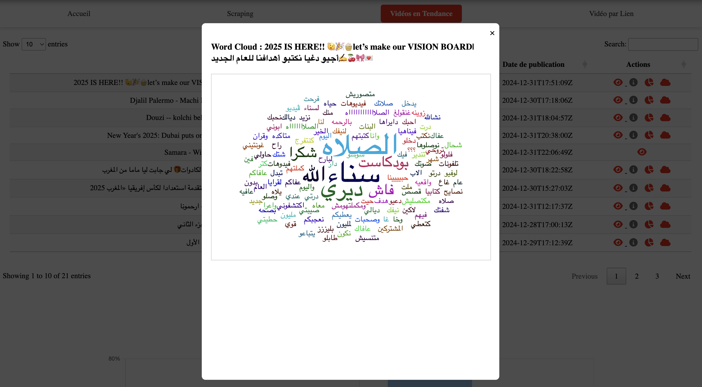

# 📊 Project-NLP: Sentiment Analysis for YouTube Comments 🎥

## General Description
Project-NLP is an application designed for sentiment analysis based on YouTube comments. It enables real-time scraping of trending videos in Morocco or specific videos via their link, analyzes the sentiment of associated comments using multiple  deep learning models (BERT, LSTM, CNN), and displays the results through an intuitive user interface. The collected data is stored in a MongoDB database, allowing further analysis of sentiments through a dashboard.

The project stands out by utilizing a multilingual model (cardiffnlp/twitter-xlm-roberta-base-sentiment) for video link scraping and specific models (BERT, LSTM, CNN) trained on Darija and Arabic datasets for trending videos. It also includes data visualization features.

## 🌟 Features

- 🔍 **Real-Time Scraping**: Scrape trending YouTube videos in Morocco or specific videos via their links.
- 🧠 **Sentiment Analysis**: Classify YouTube comments into sentiments (Positive, Negative, Neutral) using state-of-the-art models like:
  - BERT
  - LSTM
  - CNN
  - CardiffNLP/twitter-xlm-roberta-base-sentiment for multilingual analysis.
- 📊 **Data Visualization**: Generate insightful visualizations such as:
  - Word clouds for frequently used terms in comments.
  - Sentiment distribution charts.
- 📁 **MongoDB Integration**: Store scraped data and predictions in a MongoDB database for future use.
- 🖥️ **Interactive Dashboard**: View sentiment trends and analysis directly through an intuitive user interface.
- 🌍 **Darija & Arabic Compatibility**: Models trained specifically for Moroccan Darija and Modern Standard Arabic datasets.
- 🛠️ **Flask-Based Web Application**: Seamless integration with Flask for web-based interactions using HTML, CSS, and JavaScript.

## 📁 Project Structure

```bash
Project-NLP/
├── models/                    # Pre-trained models for sentiment analysis
│   ├── bert_classifier_model.pt
│   ├── bilstm_cnn_model.pth
│   ├── cnn_sentiment_model.pth
├── notebooks/                 # Notebooks for data exploration and preprocessing
│   ├── datacleaned/           # Cleaned datasets
│   ├── datausedinmodels/      # Datasets used in model training
│   ├── models/                # Notebook for models
│   ├── originalData/          # Raw datasets before preprocessing
│   ├── processdata/           # Preprocessing steps
├── static/                    # Static files (CSS, JS, Images)
├── templates/                 # HTML templates for the web interface
│   ├── Accueil.html           # Homepage
│   ├── comments_for_videolink.html # Page for video link comment analysis
│   ├── comments_video_trending.html # Page for trending video comment analysis
│   ├── home.html              # General homepage template
│   ├── link_analysis.html     # Analysis for specific video links
│   ├── trending_analysis.html # Analysis for trending videos
│   ├── video_trending.html    # Trending videos scraping interface
├── vocab/                     # Preprocessed vocabularies and encoders
│   ├── label_encoder.pkl
│   ├── label_encoderlstm.pkl
│   ├── vocab.pkl
│   ├── vocablstm.pkl
├── bert_model.py              # Implementation of BERT sentiment analysis
├── cnn_model.py               # Implementation of CNN sentiment analysis
├── database.py                # MongoDB connection and operations
├── lstm_cnn_model.py          # Implementation of LSTM-CNN sentiment analysis
├── main.py                    # Main Flask application
├── preprocess.py              # Data preprocessing utilities
├── README.md                  # Documentation for the project
  ```

## 📋 Project Overview

### 1. Libraries Used
- **PyTorch**: For building and training deep learning models.
- **Transformers**: For pre-trained BERT model and tokenizer.
- **NLTK**: For text preprocessing and stopwords removal.
- **Flask**: For creating the web application.
- **Google API Client**: For YouTube Data API integration.
- **Collections**: For data counting and manipulation.

### 2. Dataset

The project utilizes multiple datasets for training and testing the sentiment analysis models:

1. **MAC Dataset**: Contains labeled data in Moroccan Darija and Modern Standard Arabic (Neutral, Positive, Negative).  
   Source: [MAC Corpus](https://github.com/LeMGarouani/MAC/blob/main/MAC%20corpus.csv)

2. **MYC Dataset**: A dataset focused on Moroccan dialect for sentiment analysis.  
   Source: [MYC Dataset](https://github.com/MouadJb/MYC)

3. **MSAC Dataset**: Contains Positive and Negative labels for sentiment analysis in Arabic.  
   Source: [MSAC Dataset](https://github.com/ososs/Arabic-Sentiment-Analysis-corpus/blob/master/MSAC.arff)

4. **OMCD Dataset**: Includes Positive and Negative labels, along with offensive comments, specifically in Moroccan Arabic.  
   Source: [OMCD Dataset](https://github.com/kabilessefar/OMCD-Offensive-Moroccan-Comments-Dataset/blob/main/test.csv)

These datasets were preprocessed to remove noise, normalize text, and prepare them for training deep learning models. BERT models were trained on **Positive, Negative, and Neutral** labels, while LSTM and CNN models were trained on **Positive** and **Negative** labels only.

### 3. Models

The project uses multiple models for sentiment analysis, each tailored for specific tasks and datasets:

1. **BERT (Bidirectional Encoder Representations from Transformers)**  
   - Pre-trained model: `cardiffnlp/twitter-xlm-roberta-base-sentiment` for multilingual sentiment analysis, especially for videos scraped via their links.  
   - Fine-tuned on Darija and Arabic datasets for classification into **Positive**, **Negative**, and **Neutral** sentiments.

2. **LSTM (Long Short-Term Memory)**  
   - Custom-built model designed for sentiment analysis using the Darija and Arabic datasets.  
   - Trained to classify comments into **Positive** and **Negative** sentiments.

3. **CNN (Convolutional Neural Network)**  
   - A convolutional model trained on the same datasets as the LSTM.  
   - Used for fast and efficient sentiment prediction with **Positive** and **Negative** labels.

4. **CardiffNLP Model**  
   - Pre-trained `cardiffnlp/twitter-xlm-roberta-base-sentiment` model is directly used for multilingual sentiment analysis of video links.  
   - Provides predictions for **Positive**, **Negative**, and **Neutral** sentiments.

5. **Ensemble Approach**  
   - Combines predictions from BERT, LSTM, and CNN for robust sentiment classification.

Each model was trained and evaluated on preprocessed datasets.


### 7. Results

The performance of the models was evaluated using metrics such as accuracy during training and validation. Below are the results for each model:

1. **BERT**  
   - Final Accuracy: **91%**
   - The BERT model outperformed other models in terms of accuracy due to its pre-trained multilingual capabilities and fine-tuning on Darija and Arabic datasets.

2. **LSTM**
   - Training Progress:
     - Best Validation Accuracy: **78.65%** 
   - The LSTM model provided stable results but slightly underperformed compared to BERT.

3. **CNN**
   - Training Progress:
     - Best Validation Accuracy: **80.36%** 
     - Achieved training accuracy (94.29% )

## 🚀 Installation

1. **Clone the Repository**  
   - Use the following command to clone the repository:
     ```bash
     git clone https://github.com/ayaenn/nlp.git
     cd nlp
     ```

2. **Create a Virtual Environment**  
   - Create and activate a virtual environment (recommended):
     ```bash
     python -m venv venv
     source venv/bin/activate  # For Windows, use `venv\Scripts\activate`
     ```

3. **Install Required Dependencies**  
   - Install all dependencies listed in `requirements.txt`:
     ```bash
     pip install -r requirements.txt
     ```

4. **Set Up MongoDB**  
   - Install and configure MongoDB. Update the connection string in `database.py`.

---

## 💻 Usage

1. **Run the Application**  
   - Start the Flask application with:
     ```bash
     python main.py
     ```

2. **Access the Web Application**  
   - Open your browser and go to:
     ```
     http://127.0.0.1:5000/
     ```

3. **Perform Sentiment Analysis**  
   - **Trending Videos**: Scrape and analyze trending videos in Morocco.
   - **Video Links**: Analyze comments from a specific video link using `cardiffnlp/twitter-xlm-roberta-base-sentiment`.

   The system will classify comments into **Positive**, **Negative**, or **Neutral** and display insights in a dashboard.

---

## 🛠️ Technical Details

1. **Models Used**  
   - **BERT**: Fine-tuned on Darija and Arabic datasets for multi-class sentiment analysis.
   - **LSTM and CNN**: Trained for binary classification (Positive and Negative).
   - **CardiffNLP Model**: `twitter-xlm-roberta-base-sentiment` for multilingual sentiment analysis.

2. **MongoDB Integration**  
   - Data from scraped videos and comments is stored in MongoDB for dashboard analysis.

3. **Preprocessing**  
   - Includes normalization, tokenization, and stopword removal using NLTK.

---

## 📋 Requirements

Key dependencies include:
- **Python 3.9+**: Required for compatibility with the codebase.
- **Flask**: For building the web application.
- **PyTorch**: For training and running deep learning models.
- **Transformers**: For pre-trained CardiffNLP model.
- **NLTK**: For text preprocessing tasks.
- **MongoDB**: For storing scraped data and analysis results.

Refer to `requirements.txt` for a complete list of dependencies.

## 🖼️ Some Screens of the Interface

### Accueil


### Link Scraper


### Trend Scraper


### Dashboard 





